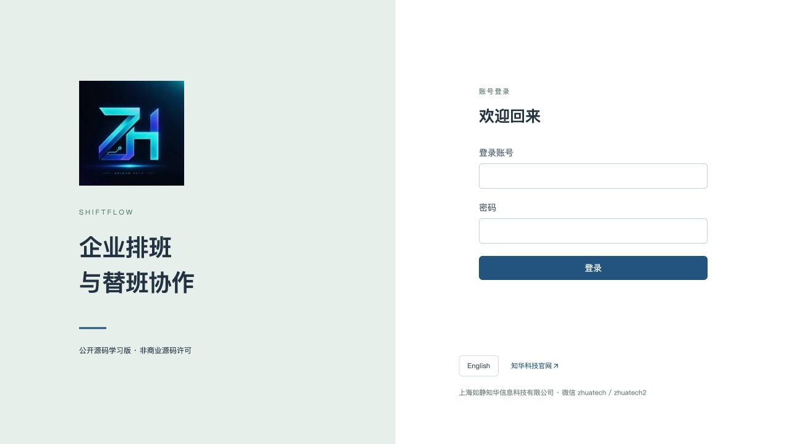
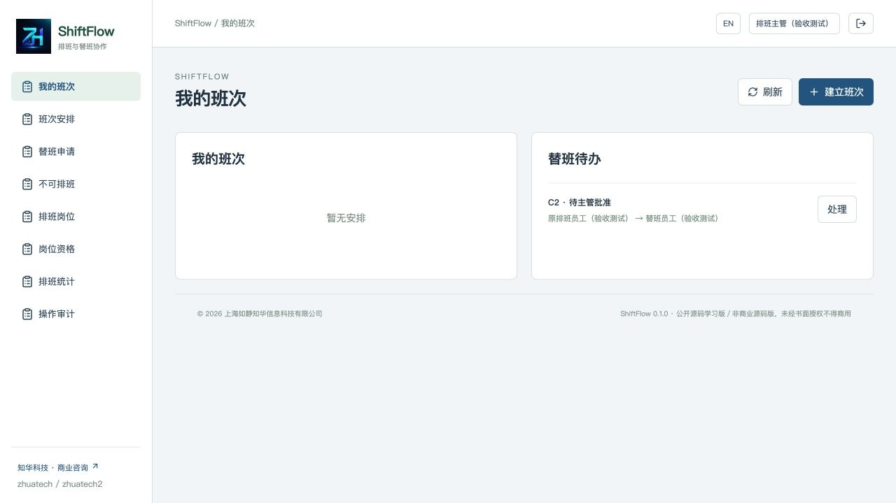
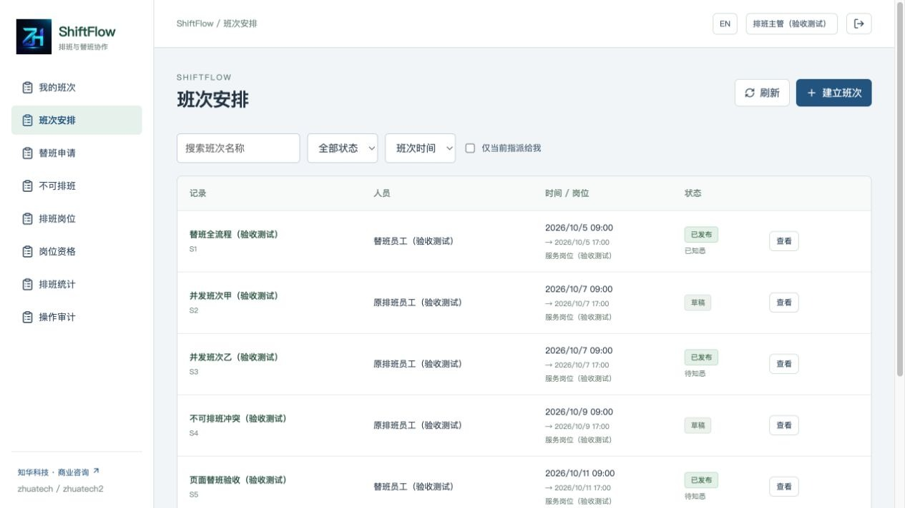
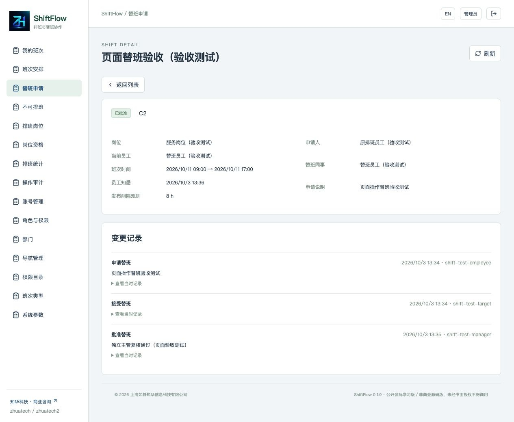
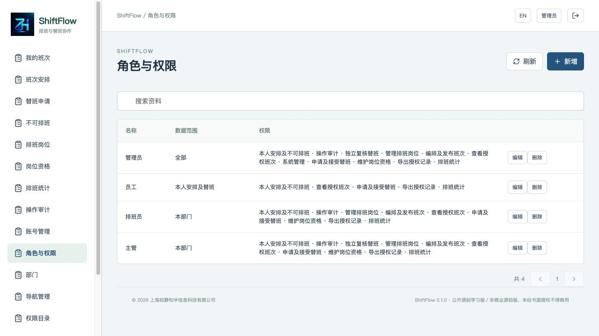
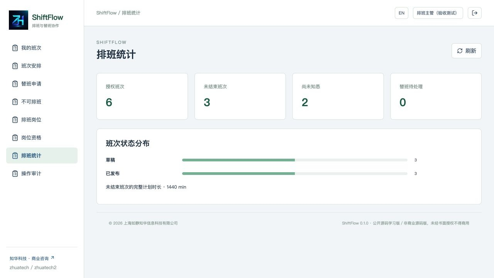

[中文](README.md) | [English](README.en.md)


# ShiftFlow · 知华科技企业排班与替班协作公开源码学习版

由 **知华科技（上海如静知华信息科技有限公司）** 提供。官网：[www.zhuatech.cn](https://www.zhuatech.cn/)。版本 **0.1.0**，采用 [ZhuaTech Non-Commercial Source License 1.0](LICENSE)，**未经书面授权不得商用**。

## 从班次计划到有人接班

部门主管经常需要确认“谁在何时承担哪个岗位”。聊天里的临时替班容易出现原员工以为已交接、替班同事尚未接受、主管不知情的问题。ShiftFlow 将岗位资格、班次时间、员工知悉和替班复核保存在同一个计划中。

适用于中小企业的服务团队、运营部门及内部值班组织，帮助减少时间冲突并保留变更依据。岗位资格是内部排班授权资料，不能替代法定资格认证。计划与知悉记录不能证明实际出勤。

### 一条班次的生命周期

1. 管理员建立部门与账号，排班员维护岗位和员工资格有效日期。
2. 排班员建立草稿，发布时检查员工是否有效、资格是否覆盖整个班次、是否与不可排班时段冲突、与其他已发布安排的间隔是否足够。
3. 员工查看本人安排，确认知悉。确认时间由服务器记录。
4. 员工指定符合条件的同事申请替班。原安排继续有效。
5. 指定同事接受后，由申请人与替班人之外的主管批准。
6. 批准时再次检查资格与时间冲突，事务内改派并清除旧确认；新员工再确认知悉。

发布后资料冻结；开始前可有理由地取消或改派。取消、改派使尚未完成的替班申请失效。历史班次不能删除，未发布草稿可以编辑或删除。开始后替班不能接受或批准，活动申请仍可拒绝或撤回以保留结论。

## 可操作范围

| 模块 | 已实现能力 |
|---|---|
| 工作台 | 本人未结束班次、待接受及待独立复核的替班 |
| 班次安排 | 草稿新增、编辑、删除；发布、知悉、取消、改派；名称搜索、状态筛选、仅当前指派给我、数据库分页及三种排序 |
| 替班申请 | 指定同事、资格及时间候选筛选、接受、独立批准、拒绝、撤回、失效及分页筛选 |
| 不可排班 | 本人登记和开始前撤销、与已发布班次冲突保护、按权限读取 |
| 岗位与资格 | 部门岗位、有效日期；发布班次保护停用、删除及员工部门/权限变更 |
| 数据与报表 | 授权范围统计、完整计划分钟数、班次 JSON 导出及不可修改的事件快照 |
| 用户业务端 | 本人安排、知悉、参与的替班、本人不可排班；权限同时由服务端校验 |
| 后台管理端 | 用户、角色、权限目录、菜单、部门、字典、参数；最后管理员保护及审计 |
| 公共能力 | BCrypt、服务端会话、CSRF、登录失败限制、统一错误、健康检查、空库初始化、版本迁移 |
| 页面 | 中文/英文切换、响应式布局、正式 LOGO、官网及授权入口 |

**尚未实现：** 自动排班、两人班次互换、多人竞领、工时核算、打卡考勤、工资结算、请假审批、劳动合规判断、消息推送、AI 排班、多租户。系统不接入付费模型或第三方业务服务，不存在静态业务演示模式。截图中的“验收测试”资料由独立测试数据库实际产生；初次部署没有员工、岗位、资格或班次业务样本。

**限制：** 每班一个员工；班次最长 12 小时；登记窗口 1–180 天，默认 90 天；相邻间隔 0–24 小时，默认 8 小时，发布时冻结规则。不同班次比较两者较大的间隔。不可排班单段最长 31 天、开始不超过未来 180 天，不收集请假证明。时间保存为 UTC，页面固定上海时区，结束瞬间按半开区间处理。已过结束时间的计划仍保留“已发布”状态并标示计划已结束，不自动认定完成出勤。

## 运行页面

### 账号入口
使用已分配账号进行岗位认证。


### 主管工作台
查看本人安排、待接受及待独立复核的替班。


### 班次安排
按授权范围搜索计划、筛选状态及查询当前指派。


### 替班交接记录
查看指定同事接受与独立主管复核的实际记录。


### 系统角色与数据范围
维护功能权限和全部／部门／本人关联的数据范围。


### 授权范围统计
统计计划状态和完整计划分钟，不作为实际出勤结论。


## 架构与工程

```text
浏览器 → Nginx :8080 → Spring Boot :8080 → MySQL 8.4
                    同源 /api          Flyway + JPA
```

数据库和后端不发布宿主机端口；前端默认仅绑定本机。账号会话保存在后端内存中，应用重启后需要重新登录，业务数据保存在数据库卷中。

| 层 | 版本与组件 |
|---|---|
| 后端 | Java 21、Maven 3.9、Spring Boot 4.0.7、Spring Security、Spring Data JPA、Flyway |
| 数据库 | MySQL 8.4；MariaDB JDBC 3.5.10 驱动；测试使用 H2 MySQL 模式 |
| 前端 | Node.js 24.19.0+、Vue 3.5.40、Vite 8.1.5、Lucide 1.48.0、ESLint、Prettier |
| 部署 | Docker Engine、Compose v2、BuildKit、Nginx 1.29；前后端非 root 运行 |

```text
backend/              Java 接口、权限与排班规则
  src/main/resources/db/migration/  V1 身份目录，V2 排班业务
  src/test/           接口集成与时间边界测试
frontend/             Vue 页面、同源 API 与界面规则测试
compose.yaml          本项目独立数据库卷及健康依赖
scripts/              本地配置、隔离验收与发布检查
docs/                 操作、架构、接口、数据库、安全、部署、截图及许可证
```

业务变更与账号管理统一加基础部门行锁，事务隔离级别 READ COMMITTED；锁后重新读取账号与角色。版本号防止旧页面覆盖；随机请求键用于业务命令精确重试，不同载荷复用同一键返回冲突。此序列化方式适用于学习部署与小规模协作，没有高并发能力承诺。管理目录、岗位、资格和审计有一万条读取上限；统计超过一万条返回限制错误。详见 [架构说明](docs/architecture.md)。

## 第一次启动

需要 Docker、Compose v2、Python 3；源码方式还需要上述 Java/Maven/Node 版本。默认账号 **admin**，密码由环境变量 `ADMIN_PASSWORD` 初始化，**没有固定演示密码**。配置生成脚本创建三个独立强密码，只保存在忽略的本地 `.env` 中，并拒绝覆盖已有文件。

```sh
python3 scripts/init-env.py
docker compose -p shiftflow-local config --quiet
docker compose -p shiftflow-local up -d --build --wait
```

访问 **[http://127.0.0.1:8104](http://127.0.0.1:8104)**；从本地 `.env` 读取 `ADMIN_PASSWORD` 后登录。启动过程执行 Flyway V1/V2，再初始化总部、四个角色、权限、菜单、三种班次字典、四项参数和管理员，重启不会重置已有密码或业务。

先建立实际部门及至少两个员工、一个独立主管，再建立岗位与资格。[操作手册](docs/operations.md) 说明如何完成首条排班。

### 本地源码调试

```sh
# 创建 .env 后，从受控终端加载配置
set -a
. ./.env
set +a
docker compose -p shiftflow-local up -d mysql
# 获取当前项目 MySQL 的内部地址，仅用于本地调试
export SPRING_DATASOURCE_URL="jdbc:mariadb://$(docker inspect shiftflow-local-mysql-1 --format '{{range .NetworkSettings.Networks}}{{.IPAddress}}{{end}}'):3306/zhuatech_shiftflow"
cd backend
mvn spring-boot:run
# 另一个终端
cd frontend
npm ci
npm run dev
```

macOS/Windows 的 Docker VM 内部地址通常无法从宿主机访问，推荐完整 Compose；Linux 可采用上述方式。前端开发服务器仅绑定 127.0.0.1，代理 `/api` 与 `/actuator` 到 `127.0.0.1:8080`。[部署手册](docs/deployment.md) 包含健康检查与恢复流程。

### 配置与升级

[.env.example](.env.example) 只列配置名称，实际值不得提交。

| 变量 | 用途 |
|---|---|
| DATABASE_PASSWORD | 专用 shiftflow 数据库用户密码 |
| MYSQL_ROOT_PASSWORD | MySQL 初始化管理密码 |
| ADMIN_PASSWORD | 仅空库创建管理员时读取；修改变量不会重置已有账号 |
| WEB_PORT | 宿主端口，默认 8104，可避免其他项目占用 |
| BIND_ADDRESS | 默认 127.0.0.1；跨机器访问应先部署 HTTPS 入口 |
| COOKIE_SECURE | 本地 HTTP 为 false，生产 HTTPS 使用 true |

数据库名 `zhuatech_shiftflow`。V1 包含账号、角色、权限、菜单、部门、字典、参数与审计；V2 包含岗位、资格、班次、替班、不可排班、事件与幂等命令，均有外键、索引或必要唯一约束。详见 [数据库说明](docs/database.md)。升级先备份卷及配置、在副本验证，再新增 `V3__...sql` 等迁移；不要修改已执行的 V1/V2，不能用删除生产卷代替升级。

## 检查、故障及协作

```sh
cd frontend
npm ci
npm run format:check
npm run lint
npm test
npm run build
cd ../backend
# 用受控环境注入 TEST_ADMIN_PASSWORD（大写、小写、数字，至少12位）
mvn spotless:check test
cd ..
docker compose -p shiftflow-check config --quiet
docker compose -p shiftflow-check up -d --build --wait
python3 scripts/smoke.py --run
# 按部署手册先重启数据库并等待健康，再重启应用
python3 scripts/smoke.py --verify
python3 scripts/release-check.py
git diff --check
```

隔离验收脚本只允许本机 HTTP 地址，需全新测试卷并会建立标明“验收测试”的账号与班次；凭证写入忽略的 `.smoke-state.json`，不输出密码。不要对业务数据库运行。当前版本有后端 12 项时间规则单元测试、37 项接口集成测试，以及前端 15 项测试，共 64 项。单元/接口测试覆盖时间边界、资格、权限、变更保护、版本、幂等、并发与替班闭环；实际 MySQL 验收和浏览器操作用于验证部署和页面。镜像构建执行后端全部测试与前端检查。[验收说明](docs/testing.md) 记录执行方法。

| 现象 | 处理 |
|---|---|
| 启动失败 | 检查 `.env` 变量、端口及当前项目服务日志；不要输出凭证 |
| 迁移/实体校验失败 | 核对迁移版本、数据库版本和表结构，不手工覆盖校验历史 |
| 登录失败 | 确认空库初始化使用的密码；重启后旧会话失效 |
| 班次发布失败 | 核对岗位、员工部门、资格日期、不可排班与相邻间隔 |
| 修改员工/资格失败 | 先取消或改派尚未开始的发布班次；进行中的安排须结束后处理 |
| 替班批准失败 | 确认对方接受、主管独立、班次未开始及候选人仍合格 |
| 状态冲突 | 刷新页面，重新打开操作；不同内容不要复用旧请求键 |

提交贡献前运行格式、测试、构建及差异检查，不提交客户数据、密码、日志或生成依赖。功能问题使用仓库 Issues，附版本、操作步骤和脱敏错误码。安全漏洞不要在公开 Issue 粘贴载荷、账号或密钥，通过官网或微信联系后提供最小复现材料。[安全说明](docs/security.md) 包含权限边界和生产部署要求。

本项目用于学习和技术交流，不构成排班合规、工资、劳动关系或法定资格的认定工具；实际使用者需完成适用规则、备份、容量和安全审查。第三方 Vue/Lucide 许可保留在 [docs/licenses](docs/licenses) 与发布静态资源中；自有代码授权以根目录 LICENSE 为准。

## 联系知华科技

商业授权或深度定制开发请联系知华科技。

本项目由知华科技（上海如静知华信息科技有限公司）提供公开源码学习版本，主要用于个人学习、技术研究与非商业交流。未经书面授权不得商用。企业信息化建设、中小企业数字化转型、中小企业 AI 转型、私有化部署、软件外包、软件项目外包、软件实施、FDE 外包、OPC 技术支持及深度定制开发，请访问知华科技官网 [https://www.zhuatech.cn/](https://www.zhuatech.cn/)，或添加微信 zhuatech、zhuatech2 咨询。

- 官网：[https://www.zhuatech.cn/](https://www.zhuatech.cn/)
- 商业授权、定制开发、部署及系统集成咨询微信：**zhuatech**、**zhuatech2**。
- 企业部署、交付、商业二次开发等需取得书面授权，许可条款与联系文案分别以 LICENSE 和本章节为准。

| 微信 zhuatech | 微信 zhuatech2 |
|---|---|
|  |  |
